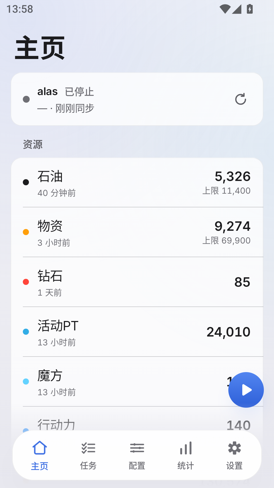
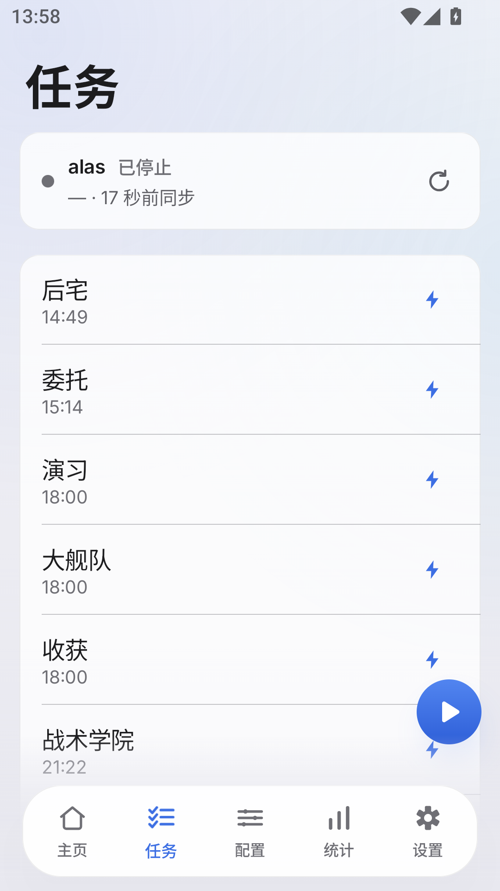
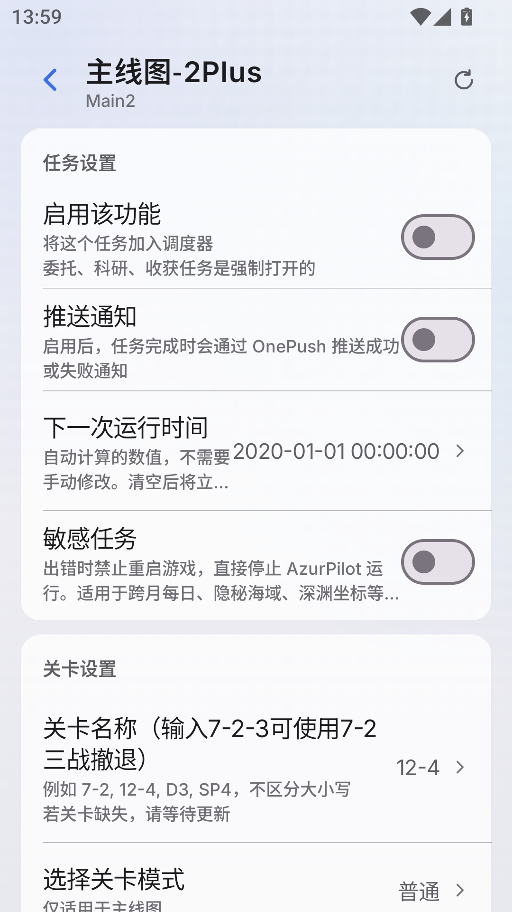
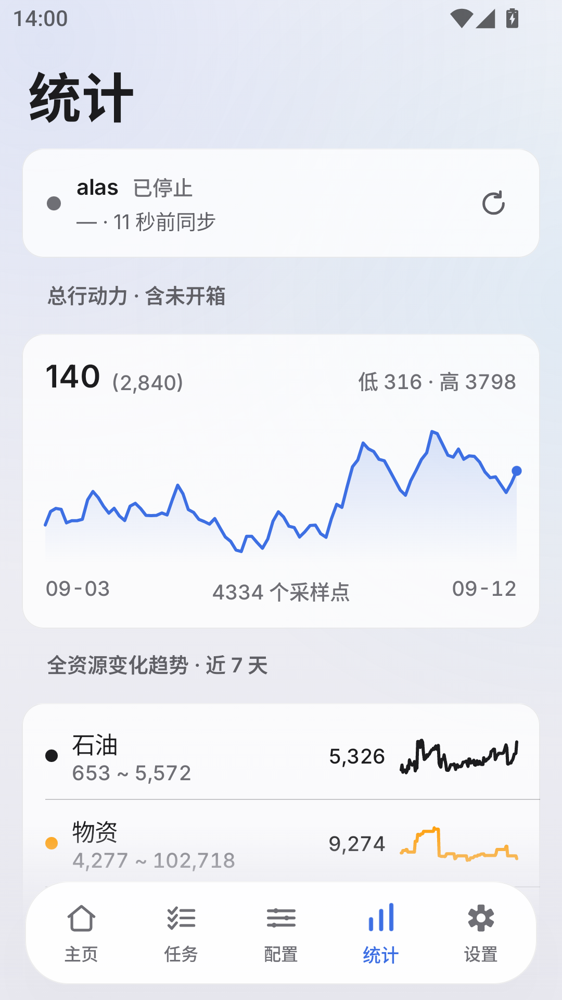
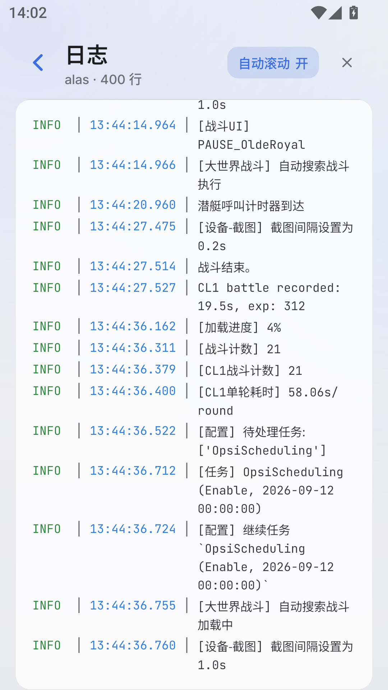
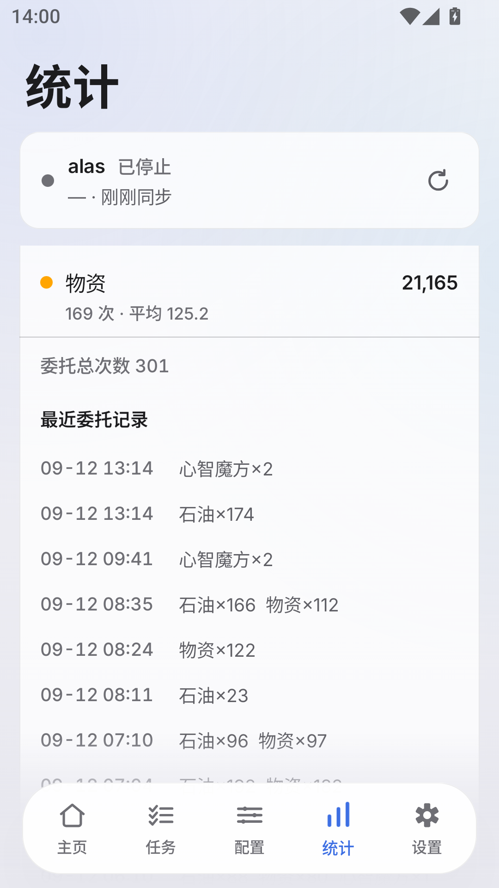
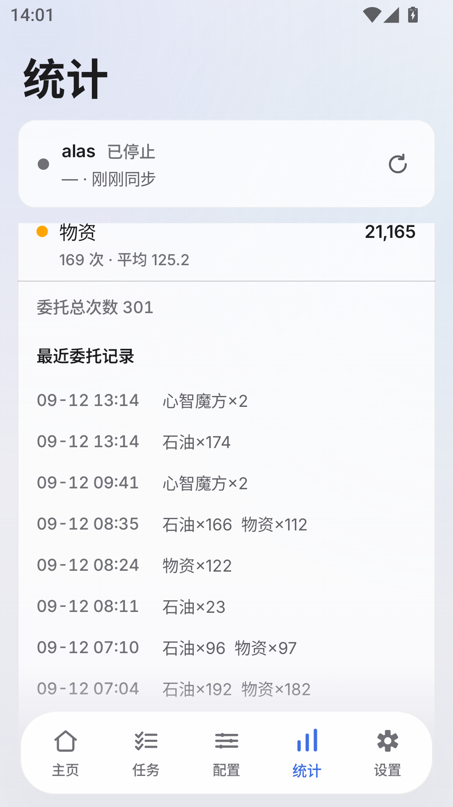
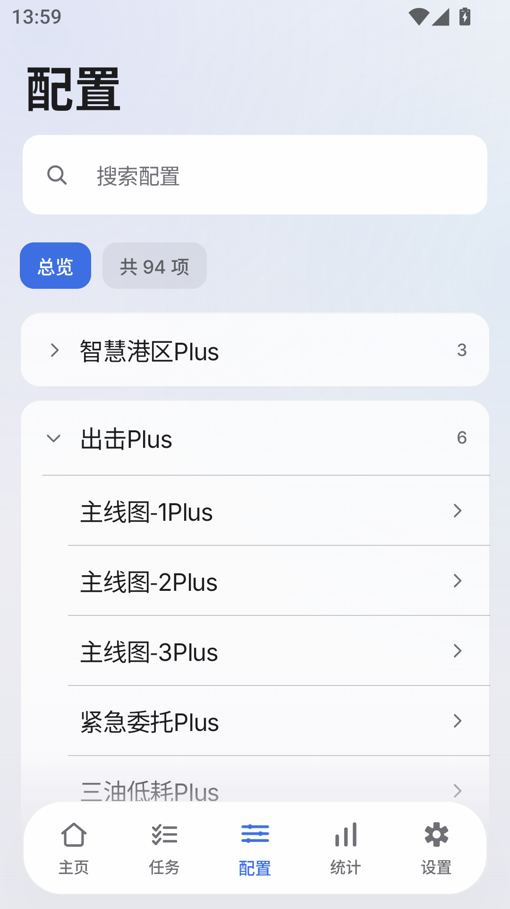
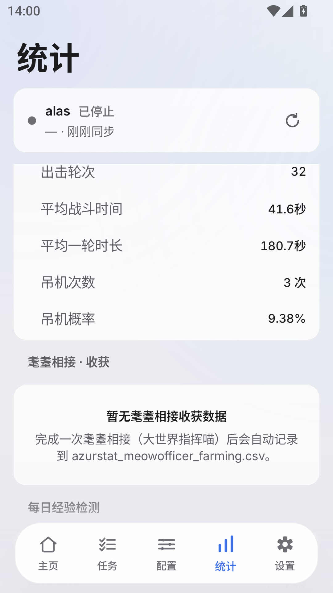
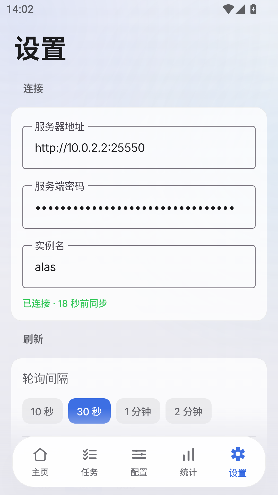

# AzurRem

**把 PC 上的 [AzurPilot](https://github.com/wess09/AzurPilot) WebUI 原生重建到安卓手机上。如果觉得好评的话请为这个项目点个star吧**

不是 WebView 套壳 —— 界面是用 Kotlin + Jetpack Compose 重写的。

电脑上跑一个**网关挂件**：它统一对外（读本地数据 + 反代操控给 AzurPilot），
AzurPilot 退到后面不再直接暴露。**手机只填一个地址 + 一个密码**，内网公网填法一样。

> 本仓库是 AzurPilot 的**第三方客户端**，包含**移植自它的代码**，因此同样以 **GPL-3.0** 发布。
> 具体哪些文件有移植关系，见文末的[许可](#许可)一节。

<p align="center">
  
  
  
  
  
</p>

---

## 🆕 1.0.4 更新了什么

**一句话：手机端从「填两个地址」变成「填一个地址 + 一个密码」，电脑端那个挂件从只读数据桥升级成了网关。**

| 变化 | 说明 |
|---|---|
| **设置页少一栏** | 去掉中间的「数据桥地址」。网关把 MCP、只读接口、数据接口全放在**同一个地址**下，不需要第二个框了 |
| **「WebUI 密码」→「服务端密码」** | 现在 App 认的是**网关自己的**密码，不再去要 AzurPilot 那把。名字跟着改，免得你去 `deploy.yaml` 里翻 |
| **网关有了状态页** | 浏览器打开那个地址就能看通不通。连不上时它会说明**是哪一种**：AzurPilot 没启动，还是密码不一致 |
| **exe 里能自己改密码** | 默认自动生成 32 位随机串，想换成记得住的直接在窗口里改（空密码或少于 8 位会被拒绝） |

修掉的三个问题：

- **「耄耋相接」「每日经验检测」一直显示「PC 上的网关没在运行」** ——
  后端接口其实是好的，是 App 把首次失败**永久缓存**成了"已加载"，之后再也不重试。
  现在按"有没有真的拿到数据"判断。
- **统计页点刷新没反应** —— 那个按钮原来只重连 MCP 快照，而统计走的是另一批接口，
  所以数字一动不动。现在会按当前页面把对应数据一起强制重拉，**进统计页时也重拉**。
- **地址裸填域名连不上**（比如只写 `example.com`）—— 现在会自动补 `https://`，
  内网 IP / `localhost` 则补 `http://`。

> ⚠️ **1.0.4 的 App 和 exe 必须一起换。** 只换一个会连不上：
> 新 App 带凭据、旧 exe 不认；新网关卡鉴权、旧 App 不带凭据。

---

## ⚠️ 三个名字别混

| 名字 | 是什么 |
|---|---|
| **AzurRem** | 本仓库 —— 安卓 App（桌面图标上显示的就是它） |
| **AzurPilot** | PC 上那个服务端项目。**本仓库不修改它任何被跟踪的文件**，只读访问 |
| **alas** | 连接设置里的**实例名**，是 AzurPilot 里的一个概念，跟上面两个都不是一回事 |

---

## 快速开始

### 1. PC 端：跑网关

下载 `AzurRemBridge.exe`，**双击**。

窗口出现，两行 —— **这两行就是手机要填的东西**：

```
网关已启动
http://192.168.1.100:25550                  ← 手机填这个（可选中复制）
密码  k7Qm2Xv9Rt4Lp1Zc8Nb6Wy3Hd5Fg0JsA     ← 手机也填这个，可以自己改（这只是示例）
[启动 AzurPilot]  [📁]
```

首次运行它会自己找 AzurPilot —— 找不到就把 AzurPilot 文件夹**拖到 exe 上**，
或者点窗口里那个 📁 手动挑。

**密码**默认是自动生成的 32 位随机串（同时也写在 exe 旁边的 `azurrem-gateway.key`）。
想换成自己记得住的，**直接在框里改，回车即生效** —— 改完 App 里也要跟着改。
空密码和少于 8 位会被拒绝：网关是公网入口，空密码等于对所有人开门。

窗口右上角四个圆点（macOS 交通灯风格）：

| 圆点 | 行为 |
|---|---|
| 🔵 缩小 | 收进 **Windows 系统托盘**（左键点托盘图标恢复，右键有「显示窗口 / 退出」） |
| 🟢 全屏 | 窗口在紧凑 / 展开两种尺寸间切换 |
| 🟡 最小化 | 最小化到**任务栏** |
| 🔴 关闭 | 停掉网关并退出进程（不留后台孤儿） |

**关掉窗口 = 网关停了**，就这么简单。想让它开机自启，把 exe 的快捷方式丢进
`shell:startup`（Win+R 输入这个就能打开启动文件夹）—— 不需要管理员权限。

浏览器打开那个地址，会看到一个状态页：绿点「已连接 AzurPilot · 请在 App 上查看数据」。
连不上时它会告诉你是**哪一种** —— AzurPilot 没启动、还是密码不一致，省得瞎猜。

### 2. 手机端：装 App

安装 `AzurRem-*.apk`，打开，进 **设置**，只有两栏要填：

| 栏 | 填什么 |
|---|---|
| **服务器地址** | 网关窗口第一行那个地址 |
| **服务端密码** | 网关窗口第二行那串 |

内网填 `http://192.168.1.100:25550`，公网填 `https://你的域名` —— **填法完全一样**。

> 地址栏**不写 `http://` 也行**：按主机名自动补，域名补 `https://`、IP 和 localhost 补 `http://`。
> 想强制用 http 就自己把 scheme 写全。
>
> **这个地址没有预设值，必须自己填。** 原因见下面的「关于安全」。

---

## 关于安全（请一定读一下）

### 代码里没有任何默认服务器地址

早期版本把开发者自己机器的内网地址硬编码成了默认值。那对开源是**有害**的：
别人装上这个 App 会直接连到那台机器上去。

所以现在地址一律由用户自己填。代码里只有一个**示例**地址
（`Settings.SAMPLE_URL`），它只出现在输入框的占位提示里，永远不会被当成默认值使用。

### 为什么要有网关这一层

**AzurPilot 自己的 HTTP 接口在 HTTP 层不做鉴权**：

- WebUI 那个密码只挡 **PyWebIO 的浏览器会话**（`module/webui/utils.py` 的 `login()`，走 WebSocket）
- `module/webui/fastapi.py` 注册的中间件只有 `GZipMiddleware` 和一个设 `Cache-Control` 的 `HeaderMiddleware` —— **没有任何鉴权中间件**
- 所以 `/api/ap_timeline`、`/api/cl1_stats` 这些，**任何人拿到地址就能读**
- 唯一有防护的是 `/api/launcher/*`，但它判的是 `is_local_request`（**来源是不是本机**），不是密码
- MCP 那一组从 AzurPilot `a265c98de` 起加了密码，但**只在设了 WebUI 密码时才生效**

**网关存在的意义就是补上这一层：**

| 面 | 做法 |
|---|---|
| **入口鉴权** | 除状态页外**每个出口**都要密码（`Authorization: Bearer` / `X-API-Key` / `?key=`，常数时间比较） |
| **两把钥匙分开** | 网关密码给你和 App；AzurPilot 那把留在电脑上，由网关读 `deploy.yaml` 后自己注入，**始终不出电脑** |
| **反代白名单** | 只放行 MCP + 两个只读统计接口。`/api/launcher/startup`（能拉起进程）、`/api/import_legacy_upload`（能传文件）、`/ws/live_control`（**真能点屏幕**）一概不转 |
| **网关自己没有写接口** | 需要写的（启停、执行任务、改配置）一律走 MCP 转给 AzurPilot；POST 到只读路径直接 405 |
| **日志脱敏** | 密码不写进 `AzurRemBridge.log`（那是排查问题时会被贴出来的东西） |

### 仍然要守的规矩

- **网关放公网是可以的，但密码必须是强的** —— 它背后就是能启停脚本、能点屏幕的完整控制面
- **别把 AzurPilot 自己的 25548 直接暴露到公网** —— 那一层没有鉴权，网关必须挡在它前面
- 不要在不可信的 WiFi 下开着网关
- 觉得密码可能漏了：删掉 exe 旁边的 `azurrem-gateway.key` 再启动，会生成新的一把（App 里也要改）

---

## 功能

| Tab | 内容 |
|---|---|
| **主页** | 状态卡 + 资源分组列表 + 右下角可拖动的启停悬浮按钮 |
| **任务** | 运行中 / 队列中 / 等待中 三段；整行点击进配置页，右侧 ⚡ 确认后立即执行。启停按钮在这个 Tab 也有 |
| **配置** | 搜索框 + 10 个可折叠分组 → 93 个任务，点进去编辑 |
| **统计** | 总行动力曲线 · 全资源趋势 · 侵蚀1 月度 · **委托收益统计** · 耄耋相接（数据收集 + 收获）· 每日经验检测 |
| **设置** | 连接 / 刷新 / 外观 / 工具（日志）/ 任务配置缓存 / 关于 |

<p align="center">
  
  
  
  
  
</p>

### 几个刻意做对的细节

- **任务页的三段逐行对齐 PC 概览页**（`app_dashboard.py:41-51`）。最容易漏的一条：
  **实例没在跑时「运行中」为空，所有逾期任务全部留在「队列中」**。
  「队列中」按 `SCHEDULER_PRIORITY` 排序，不是时间序 —— 所以第一条才是"下一个真要跑的任务"。
- **任务配置页是中文的**。MCP 自带的 `get_task_help` 因为 i18n 布局问题会退回英文键，
  所以结构走网关自己做的 join，当前值才走 MCP `get_config`。
- **配置页秒开**。见下面「预缓存」。
- **日志是准实时的**：按字节 offset 增量读，1 秒一次；只在日志页打开时才拉，切后台自动停。

---

## 预缓存：为什么点开配置页是"秒开"

AzurPilot 的 `mcp_server_sse.py` 里：

```python
async def _tool_get_config(arguments):
    config = AzurLaneConfig(inst)      # ← 每次都重建整个配置对象
    data = config.data.get(task, {})
```

它声明成 `async def`，但 `AzurLaneConfig(inst)` 是**同步重活**（读全部配置 + 深度合并默认值 + 校验），
跑在 uvicorn 的**单事件循环**上 —— 执行期间整个循环都被堵住。

而 App 每打开一个配置页要**新开一轮 MCP 会话**：

```
GET /mcp/sse 等 endpoint  →  initialize  →  notifications/initialized  →  tools/call get_config
```

整整 4 次往返，每一次都得排在别人后面。实测（PC 本地、无竞争）：

| 步骤 | 耗时 |
|---|---|
| 桥 `/api/task_schema` | 14 ms |
| MCP: SSE 握手 | 7 ms |
| MCP: initialize | 3 ms |
| MCP: initialized 通知 | 2 ms |
| MCP: `get_config` | 26 ms（最慢 135 ms） |
| **合计** | **50 ms** |

手机上还要叠加 WiFi 往返和信号抖动，用户看到的就是「点进去卡一下」。

服务端不能改（会被自动更新覆盖），所以缓存放手机这边：

- **拉一次，之后纯本地读** —— 任务树到手后，后台用**一个 MCP 会话**把 93 个任务的配置全拉下来
  （实测 2.6 秒；逐个开新会话要 4.7 秒）
- 命中缓存就**直接渲染，一帧骨架屏都不给**，然后后台静默校验
- 校验失败**不动界面** —— 用户手上那份数据是可用的，弹错误只会让人以为页面坏了
- 缓存在 `filesDir/config_cache.json`，**杀进程重开照样秒开**

设置页能看到缓存了多少个任务，也有「重新预缓存」。

---

## 架构

```
                    ┌──────────── AzurRemBridge.exe（网关挂件）────────────┐
浏览器 ── GET /   ──▶│ 极简状态页：「已连接 AzurPilot · 请在 App 上查看」    │
（唯一不鉴权）       │                                                     │
App ──── /mcp/*   ──▶│ 验 App 的密码 → 注入 AzurPilot 的密码 → 转发 :25548  │
App ──── /api/两个 ──▶│ 只放行 ap_timeline 与 cl1_stats，同样注入密码        │
App ──── 9 条数据 ──▶│ 自己读本地库（cl1_data.db / CSV / JSON …）           │
                    └───────────────────────┬─────────────────────────────┘
                                            │ 只读文件
                                            ▼
                                 ┌──────────────────────┐
                                 │  D:\...\AzurPilot     │
                                 │  config/  log/        │
                                 └──────────────────────┘
```

**AzurPilot 不再直接对公网** —— 它只被网关在本机访问。

### 为什么必须有这一层

AzurPilot 的 WebUI **只暴露两个数据接口**（`/api/cl1_stats`、`/api/ap_timeline`）——
连它自己的 `obs_overlay.html` 也只用这两个。统计页是服务端渲染 HTML 的，
日志走 PyWebIO 的会话 WebSocket，队列优先级是运行时算的。

所以资源历史、耄耋相接、委托收益、每日经验、日志增量这些**没有 JSON 出口**，
只能由 PC 上的程序读出来。

**网关放在本仓库里，不在 AzurPilot 目录中** —— AzurPilot 升级是
`git reset --hard` + `git pull --ff-only`，放进去会被清掉。网关只读访问那个目录。

顺带它还把 AzurPilot 那几个没有鉴权的接口挡在了后面（见上面「关于安全」）。

### 数据来源

| 数据 | 来源 |
|---|---|
| 资源当前值、状态、启停、调度队列、日志（兜底） | 网关反代到 AzurPilot 自带的 **MCP 服务**（`/mcp`） |
| 任务配置的**当前值 / 写入** | MCP `get_config` / `update_config`（经网关） |
| 任务配置的**中文结构** | 网关 `/api/task_schema` |
| 总行动力曲线 | 网关 `/api/ap_timeline`（反代） |
| 侵蚀1 月度统计 | 网关 `/api/cl1_stats`（反代）+ 客户端按 PC 口径派生 |
| 全资源历史趋势 | 网关 `/api/resource_history` |
| 任务菜单树（10 组 93 项） | 网关 `/api/task_tree` |
| 概览队列三段 | 网关 `/api/overview_tasks` |
| 日志（准实时） | 网关 `/api/logs/tail`（字节 offset 增量） |
| **委托收益统计** | 网关 `/api/commission_income`（`config/cl1_data.db`） |
| 耄耋相接 · 数据收集 | 网关 `/api/meow_hazard`（同一个 db） |
| 耄耋相接 · 收获 | 网关 `/api/meow_stats`（`azurstat_meowofficer_farming.csv`） |
| 每日经验检测 | 网关 `/api/ship_exp`（`log/cl1/<实例>/ship_exp_data.json`） |

> 除最后 6 条以外，其余都是**网关反代 AzurPilot**；网关自己只负责读那 6 类本地文件。

### 口径对齐：数字必须和 PC 一样

网关上凡是"重算"的逻辑，都配了一个与 AzurPilot 原实现**逐字段对照**的脚本：

```powershell
# 用 **AzurPilot 自己的 venv** 跑（脚本要 import 它的 module.statistics.*）
$AP = "C:\path\to\AzurPilot"      # ← 换成你的 AzurPilot 目录

# 每日经验检测（移植了 module/statistics/ship_exp_stats.py，125 项经验表 + 61 个字段）
& "$AP\.venv\Scripts\python.exe" bridge\verify_ship_exp_parity.py

# 委托收益统计（移植了 module/statistics/commission_income_stats.py）
& "$AP\.venv\Scripts\python.exe" bridge\verify_commission_parity.py
```

两个都必须是 `[PASS]`。这类偏差**很隐蔽** —— 不专门对比，根本发现不了
手机上比电脑上少了 3 个钻石。

---

## 应用内更新

**设置 → 关于 → 版本**，点一下就检查有没有新版。有的话直接下载 APK 并交给系统安装程序，
不用手动去 GitHub 找。

数据源是本仓库的 GitHub Releases：

```
GET https://api.github.com/repos/syyxl3111/AzurRem/releases/latest
```

这个接口**匿名可访问**（实测 HTTP 200），所以 App 不需要任何密钥、也不需要 token。

### 发新版时的约定（不遵守就检查不到）

1. **tag 用 `v<版本号>`**，例如 `v1.0.3`。解析时会剥掉 `v`，写成 `1.0.3` 也认
2. **APK 作为 Release 资产上传，文件名以 `.apk` 结尾**。
   有多个 `.apk` 资产时取第一个，所以**一个 Release 只放一个 APK**
3. 版本号用点分数字。比较是**逐段按数值**比的，不是字符串比 ——
   否则 `1.0.10` 会被判成比 `1.0.9` 旧（这条有单元测试钉着）

发版流程：

```powershell
cd AzurPilotMobile
# 1. 改 app/build.gradle.kts 的 versionCode / versionName
.\gradlew.bat assembleDebug
# 2. 把 APK 传成 Release 资产
gh release create v1.0.4 "AzurRem-1.0.4.apk" --title "..." --notes "..."
```

> ⚠️ **改了内容就必须 +1 `versionCode`，哪怕 `versionName` 没变。**
>
> 这条踩过：1.0.4 先后打了**三个内容不同**的包（改设置页之前一个、之后两个），
> `versionCode` 全是 5。Android 只按 `versionCode` 判断新旧，所以装了 code=5 的机器
> **不会被同样是 code=5 的新包覆盖** —— 用户装完打开一看还是旧界面，
> 而系统里显示"版本 1.0.4"，两边对不上，极难排查。
>
> 现在 1.0.4 的 code 演进：**5**（首包）→ **6**（设置页精简）→ **7**（地址自动补 scheme）
> → **8**（界面文案统一改叫「网关」）。

> ⚠️ **APK 是 debug 签名。** 同一台机器上构建的后续版本可以直接覆盖升级；
> 如果换了构建机器（或弄丢了 `~/.android/debug.keystore`），
> 升级会因为签名不一致失败，用户需要先卸载旧版。

> ⚠️ **从 1.0.2 升到 1.0.3 需要手动装一次** —— 1.0.2 里还没有更新检查功能。
> 装上 1.0.3 之后，以后就都能在 App 内更新了。

> ⚠️ **1.0.4 起 PC 端也要一起换。** 手机端走的是新的网关协议（一个地址 + 一个密码），
> 旧的 `AzurRemBridge.exe` 不做反代、也没有鉴权，配不上。

---

## 构建

### Android App

```powershell
cd AzurPilotMobile
.\gradlew.bat assembleDebug
# 产出 app\build\outputs\apk\debug\app-debug.apk
```

| 组件 | 版本 |
|---|---|
| Android SDK | build-tools 36.0.0 / android-37.0 |
| AGP / Gradle / Kotlin | 9.3.2 / 9.5.0 / 2.4.10 |
| minSdk / targetSdk | 26 / 37 |

路径里有中文时 AGP 会拒绝构建，`gradle.properties` 里的 `android.overridePathCheck=true` 已经绕过了。

**跑单元测试：**

```powershell
.\gradlew.bat :app:unitTest
```

> 为什么不用标准的 `:app:testDebugUnitTest`？它在某些环境下起不来 ——
> Gradle 的 test worker 子进程刚启动就退出，报
> `ClassNotFoundException: GradleWorkerMain` 并伴随 `java.io.IOException: 管道正在被关闭`。
> 已排除的猜想：worker 的 jar 没缺（都在）、中文路径（换成 ASCII 目录联接一样挂）、`--no-daemon`。
> `:app:unitTest` 直接 fork java 跑 JUnit，绕开 worker API。

### 网关 exe

```powershell
bridge\build-exe.bat
# 产出 dist\AzurRemBridge.exe
```

需要 `pyinstaller`。打包参数是 `--onefile --noconsole`（无控制台窗口）+ 图标
`bridge/azurrem.ico`。

**验证：**

```powershell
python bridge\gateway_test.py                 # 网关专项 29 项（鉴权/状态页/MCP 反代/白名单）
python bridge\gui_test.py                     # 挂件窗口自测 89 项（含密码可改）
python bridge\smoke_test_exe.py --port 25561   # 真 exe：8 个接口全 200
python bridge\tray_test_exe.py  --port 25565   # 真 exe：托盘往返
```

前两个不需要打包，直接跑源码；后两个要先把 exe 打出来。
`gateway_test.py` 里还有一条**静态检查**：扫 Kotlin 源码里「注释中写通配路径」的写法 ——
Kotlin 的块注释可以嵌套，一个星号就能把后面整个文件吞掉，而编译器只在文件末尾报
`Unclosed comment`，极难往回找（这个坑踩过两次，所以让测试盯着）。

---

## 已知限制

- **只在竖屏验证过**，已锁 `screenOrientation="portrait"`
- **日志是「准实时」不是「实时」**：PC 面板是 0.25 秒，但它读的是内存里的 Rich 对象走
  PyWebIO 会话通道，没有可复用的接口。App 是字节 offset 增量 + 1 秒轮询
- **任务级进度百分比**：AzurPilot 本身没有这个概念，App 也做不了
- **实时画面 / 触控**（`/ws/live_screenshot`、`/ws/live_control`）还没接。
  网关的**反代白名单也刻意没放它们** —— 那是真能点屏幕的接口，不该顺手搬上公网
- 网关**没有自启机制**，重启电脑后要手动双击（或用启动文件夹里的快捷方式）
- **原版 WebUI 不在网关后面**：网关只管 App 的数据面。想在公网用原版 WebUI，
  得另外给它开一个域名指到 25548（别直接暴露 —— 那一层没有鉴权）
- `TaskHoardingDuration` 的偏移量网关里没实现，调大会导致队列分桶有偏差

---

## 免责声明

这是一个**非官方**的第三方客户端，与 AzurPilot 项目无关。

请遵守你所在地的法律法规以及游戏的服务条款。因使用本工具产生的一切后果由使用者自行承担。

## 许可

**GNU General Public License v3.0** —— 见 [LICENSE](LICENSE)。

```
AzurRem —— AzurPilot 的原生安卓客户端 + PC 端网关挂件
Copyright (C) 2026 syyxl3111

This program is free software: you can redistribute it and/or modify
it under the terms of the GNU General Public License as published by
the Free Software Foundation, either version 3 of the License, or
(at your option) any later version.

This program is distributed in the hope that it will be useful,
but WITHOUT ANY WARRANTY; without even the implied warranty of
MERCHANTABILITY or FITNESS FOR A PARTICULAR PURPOSE.  See the
GNU General Public License for more details.
```

### 为什么是 GPL-3.0

不是偏好，是**上游要求**：本项目包含**移植自 [AzurPilot](https://github.com/wess09/AzurPilot)
的代码**，而 AzurPilot 是 GPL-3.0 授权的。GPL-3.0 具有 copyleft 性质 ——
分发衍生作品时，衍生作品也必须以同样的许可发布。

有移植关系的部分（都有注释标注出处）：

| 文件 | 来源 |
|---|---|
| `bridge/mobile_bridge.py` | `module/statistics/ship_exp_stats.py`（经验表与计算方法） |
| `bridge/commission_stats.py` | `module/statistics/commission_income_stats.py`（聚合口径） |
| `AzurPilotMobile/…/data/McpClient.kt` | `module/webui/app_stat_opsi.py`（侵蚀1 派生公式） |
| `AzurPilotMobile/…/data/Models.kt` | `module/webui/app_dashboard.py`（队列三段切法） |
| `AzurPilotMobile/…/ui/Format.kt` | `module/config/i18n/zh-CN.json`（任务中文名兜底表） |

### 这意味着什么

- ✅ 你可以自由使用、修改、分发，**甚至可以卖**
- ✅ 如果你改了再分发，**必须也开源**（同样 GPL-3.0）
- ✅ 必须保留版权声明和「无担保」声明
- ❌ 不能把这份代码（或它的衍生版）做成闭源软件

